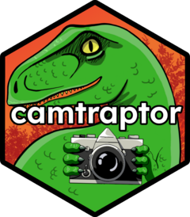

<!-- README.md is generated from README.Rmd. Please edit that file -->

```{r, include = FALSE}
knitr::opts_chunk$set(
  collapse = TRUE,
  comment = "#>",
  fig.path = "man/figures/README-",
  out.width = "100%"
)
```

# camtraptor <a href="https://inbo.github.io/camtraptor/"></a>

<!-- badges: start -->
[](https://github.com/inbo/camtraptor/actions/workflows/R-CMD-check.yaml)
[](https://github.com/inbo/camtraptor/releases)
[](https://inbo.r-universe.dev/camtraptor)
[](https://www.repostatus.org/#active)

[](https://github.com/inbo/camtraptor/actions/workflows/pkgcheck.yaml)
[](https://app.codecov.io/gh/inbo/camtraptor)
[](https://github.com/inbo/camtraptor/actions/workflows/test-coverage.yaml)
<!-- badges: end -->

camtraptor is an R package to explore and visualize Camera Trap Data Packages ([Camtrap DP](https://camtrap-dp.tdwg.org/)). It offers a step-by-step workflow to read Camtrap DP files, filter data of interest, summarize information (e.g. number of observed species) and visualize this per deployment on an interactive map. You can also use it to transform data for analysis in [camtrapR](https://cran.r-project.org/package=camtrapR).

::: {.callout-note}
camtraptor 1.0 updates the internal data model to Camtrap DP 1.0 and drops support for Camtrap DP 0.1.6. This breaking change is accompanied by a number of other major changes. See the [changelog](https://inbo.github.io/camtraptor/news/index.html#camtraptor-100) for details.
:::

## Get started

To get started, see:

- [Vignettes](https://inbo.github.io/camtraptor/articles/): tutorials showcasing functionality.
- [Function reference](https://inbo.github.io/camtraptor/reference/index.html): overview of all functions.

## Installation

You can install the development version of camtraptor from
[GitHub](https://github.com/) with:

``` r
# install.packages("pak")
pak::pak("inbo/camtraptor")
```

## Example

Get an overview of the species detected in an example Camera Trap Data Package dataset:

```{r}
library(camtraptor)
x <- example_dataset()
taxa(x)
```

Filter the observations in the dataset on female mallards (Anas platyrhynchos) and map the number of recorded individuals for each deployment location:

```{r}
x %>%
  filter_observations(
    scientificName == "Anas platyrhynchos",
    sex == "female"
  ) %>%
  summarize_observations() %>%
  map_summary(feature = "sum_count")
```

## Relation to other R packages

- [camtrapdp](https://cran.r-project.org/package=camtrapdp) is a core R package to read and manipulate Camtrap DPs. camtraptor depends on camtrapdp and re-exports a number of functions so that users don't need to load both packages.
- [camtrapR](https://cran.r-project.org/package=camtrapR) is an analysis R package for camera trap data. camtraptor still offers a number of (deprecated) functions to transform Camtrap DPs to outputs compatible with camtrapR. Notice that camtrapR supports now Camtrap DP format.
- [camtrapDensity](https://github.com/MarcusRowcliffe/camtrapDensity) is a development R package to run single species random encounter models to estimate animal density. camtraptor is a dependency.

## Meta

- We welcome [contributions](.github/CONTRIBUTING.md) including bug reports.
- License: MIT
- Get citation information for camtraptor in R with `citation("camtraptor")`.
- Please note that this project is released with a [Contributor Code of Conduct](.github/CODE_OF_CONDUCT.md). By participating in this project you agree to abide by its terms.
