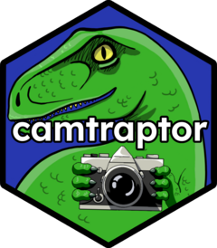
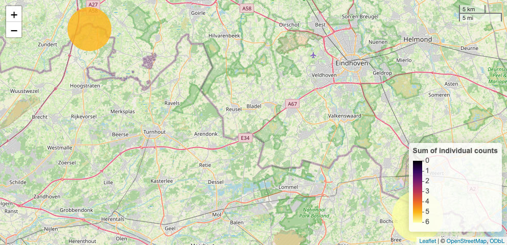

<!-- README.md is generated from README.Rmd. Please edit that file -->

# camtraptor <a href="https://inbo.github.io/camtraptor"></a>

<!-- badges: start -->

[](https://CRAN.R-project.org/package=camtraptor)
[](https://github.com/inbo/camtraptor/actions/workflows/R-CMD-check.yaml)
[](https://github.com/inbo/camtraptor/releases)
[](https://inbo.r-universe.dev/camtraptor)
[](https://app.codecov.io/gh/inbo/camtraptor/)
[](https://www.repostatus.org/#active)

<!-- badges: end -->

Camtraptor is an R package to read, explore and visualize Camera Trap
Data Packages (Camtrap DP). [Camtrap DP](https://camtrap-dp.tdwg.org) is
a community developed data exchange format for this type of data. With
camtraptor you can read and filter data, create overviews of observed
species, relative abundance or effort, and plot these data on a map.

## Camtrap DP

Camtraptor currently uses the legacy Camtrap DP 0.1.6 for its internal
data model. `read_camtrap_dp()` will automatically down-convert Camtrap
DP 1.0 datasets to that legacy model to avoid introducing breaking
changes. The downside is that some newer properties like
`deployments.cameraDepth`, `media.filePublic` and
`observations.eventEnd` are removed when reading data.

The upcoming [camtraptor
v1.0](https://github.com/inbo/camtraptor/milestone/3) will update the
internal data model to Camtrap DP 1.0 and drop support for Camtrap DP
0.1.6. This is a breaking change that will be accompanied by a number of
other major changes. Future versions of camtraptor will always use the
latest version of Camtrap DP and up-convert legacy datasets to that
model.

## Get Started

To get started, see:

- [Vignettes](https://inbo.github.io/camtraptor/articles/): tutorials
  showcasing functionality.
- [Function
  reference](https://inbo.github.io/camtraptor/reference/index.html):
  overview of all functions.

## Installation

You can install the stable version of **camtraptor** from the INBO R
universe:

``` r
install.packages("trias", repos = "https://inbo.r-universe.dev")
```

You can install the development version of camtraptor from
[GitHub](https://github.com/inbo/camtraptor) with:

``` r
# install.packages("devtools")
devtools::install_github("inbo/camtraptor")
```

While we support older versions of R up to 3.5, we recommend using R
4.0.0 or higher.

## Example

Get the taxonomic coverage for an example Camera Trap Data Package
`mica`:

``` r
library(camtraptor)
get_species(mica)
#> # A tibble: 9 × 5
#>   taxonID taxonIDReference  scientificName vernacularNames.en vernacularNames.nl
#>   <chr>   <chr>             <chr>          <chr>              <chr>             
#> 1 DGP6    https://www.cata… Anas platyrhy… mallard            wilde eend        
#> 2 DGPL    https://www.cata… Anas strepera  gadwall            krakeend          
#> 3 32FH    https://www.cata… Ardea          great herons       reigers           
#> 4 GCHS    https://www.cata… Ardea cinerea  grey heron         blauwe reiger     
#> 5 RQPW    https://www.cata… Castor fiber   Eurasian beaver    bever             
#> 6 6MB3T   https://www.cata… Homo sapiens   human              mens              
#> 7 3Y9VW   https://www.cata… Martes foina   beech marten       steenmarter       
#> 8 44QYC   https://www.cata… Mustela putor… European polecat   bunzing           
#> 9 5BSG3   https://www.cata… Vulpes vulpes  red fox            vos
```

Filter observations in `mica` on female mallards and map the number of
individuals per deployment location:

``` r
map_dep(
  mica,
  feature = "n_individuals",
  species = "Anas platyrhynchos",
  sex = "female"
)
#> There are 4 deployments without observations: 29b7d356-4bb4-4ec4-b792-2af5cc32efa8, 577b543a-2cf1-4b23-b6d2-cda7e2eac372, 62c200a9-0e03-4495-bcd8-032944f6f5a1 and 7ca633fa-64f8-4cfc-a628-6b0c419056d7
```



## camtraptor vs camtrapR and activity

Camtraptor provides and bundles much needed functionality to read,
explore and visualize Camera Trap Data Packages. Over time we hope to
include some or all of this functionality in widely used R packages such
as [camtrapR](https://cran.r-project.org/package=camtrapR) and
[activity](https://cran.r-project.org/package=activity).

## Meta

- We welcome [contributions](.github/CONTRIBUTING.md) including bug
  reports.
- License: MIT
- Get citation information for camtraptor in R doing
  `citation("camtraptor")`.
- Please note that this project is released with a [Contributor Code of
  Conduct](.github/CODE_OF_CONDUCT.md). By participating in this project
  you agree to abide by its terms.
