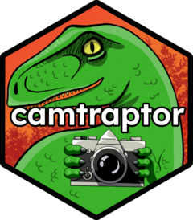
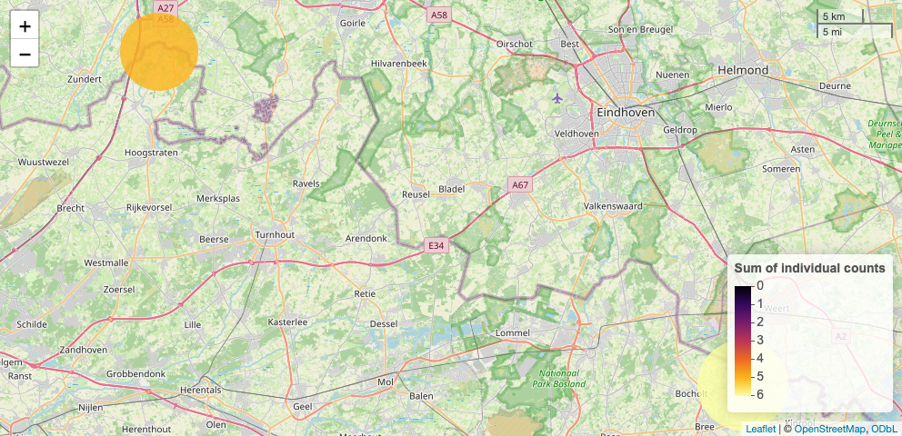

<!-- README.md is generated from README.Rmd. Please edit that file -->

# camtraptor <a href="https://inbo.github.io/camtraptor"></a>

<!-- badges: start -->

[](https://CRAN.R-project.org/package=camtraptor)
[](https://github.com/inbo/camtraptor/actions/workflows/R-CMD-check.yaml)
[](https://github.com/inbo/camtraptor/releases)
[](https://inbo.r-universe.dev/camtraptor)
[](https://www.repostatus.org/#active)

[](https://github.com/inbo/camtraptor/actions/workflows/pkgcheck.yaml)
[](https://app.codecov.io/gh/inbo/camtraptor)
[](https://github.com/inbo/camtraptor/actions/workflows/test-coverage.yaml)
<!-- badges: end -->

Camtraptor is an R package to **read**, **explore** and **visualize**
[Camera Trap Data Packages](https://camtrap-dp.tdwg.org) (Camtrap DP)
datasets. Camtrap DP is a community developed data exchange format for
camera trap data. With camtraptor you can create overviews of observed
species, relative abundance or effort, and plot these data on a map.

> **Note:** [camtraptor
> v1.0](https://github.com/inbo/camtraptor/milestone/3) has updated the
> internal data model to Camtrap DP 1.0 and has dropped support for
> Camtrap DP 0.1.6. This is a breaking change that is accompanied by a
> number of other major changes. See
> [News](https://inbo.github.io/camtraptor/news/index.html).

## Get started

To get started, see:

- [Vignettes](https://inbo.github.io/camtraptor/articles/): tutorials
  showcasing functionality.
- [Function
  reference](https://inbo.github.io/camtraptor/reference/index.html):
  overview of all functions.

## Installation

You can install the stable version of **camtraptor** from the INBO
R-universe:

``` r
install.packages("camtraptor", repos = "https://inbo.r-universe.dev")
```

You can install the development version of camtraptor from
[GitHub](https://github.com/inbo/camtraptor) with:

``` r
# install.packages("devtools")
devtools::install_github("inbo/camtraptor")
```

While we support older versions of R up to 3.5, we recommend using R
4.0.0 or higher.

## Example

Get an overview of the species detected in an example Camera Trap Data
Package dataset included in the camtraptor package:

``` r
library(camtraptor)
x <- example_dataset()
taxa(x)
#> # A tibble: 10 × 5
#>    scientificName     taxonID  taxonRank vernacularNames.eng vernacularNames.nld
#>    <chr>              <chr>    <chr>     <chr>               <chr>              
#>  1 Anas platyrhynchos https:/… species   mallard             wilde eend         
#>  2 Anas strepera      https:/… species   gadwall             krakeend           
#>  3 Ardea              https:/… genus     great herons        reigers            
#>  4 Ardea cinerea      https:/… species   grey heron          blauwe reiger      
#>  5 Aves               https:/… class     bird sp.            vogel              
#>  6 Homo sapiens       https:/… species   human               mens               
#>  7 Martes foina       https:/… species   beech marten        steenmarter        
#>  8 Mustela putorius   https:/… species   European polecat    bunzing            
#>  9 Rattus norvegicus  https:/… species   brown rat           bruine rat         
#> 10 Vulpes vulpes      https:/… species   red fox             vos
```

Filter the observations in the dataset on female mallards (Anas
platyrhynchos) and map the number of recorded individuals for each
deployment location:

``` r
x %>%
  filter_observations(
    scientificName == "Anas platyrhynchos",
    sex == "female"
    ) %>%
  summarize_observations() %>%
  map_summary(feature = "sum_count")
```



## Relationship to other camera trap packages available in R

Camtraptor aims to become a useful toolkit for camera trap data analysis
by including functionality from other R packages such as
[camtrapR](https://cran.r-project.org/package=camtrapR) and
[activity](https://cran.r-project.org/package=activity), while following
the Camtrap DP exchange format. Functions prefixed with `camtrapR_`
produce outputs as returned by camtrapR functions.

## Meta

- We welcome [contributions](.github/CONTRIBUTING.md) including bug
  reports.
- License: [MIT](https://opensource.org/license/mit) + file
  [LICENSE](https://inbo.github.io/camtraptor/LICENSE-text.html)
- Get citation information for camtraptor in R with
  `citation("camtraptor")`.
- Please note that this project is released with a [Contributor Code of
  Conduct](.github/CODE_OF_CONDUCT.md). By participating in this project
  you agree to abide by its terms.
