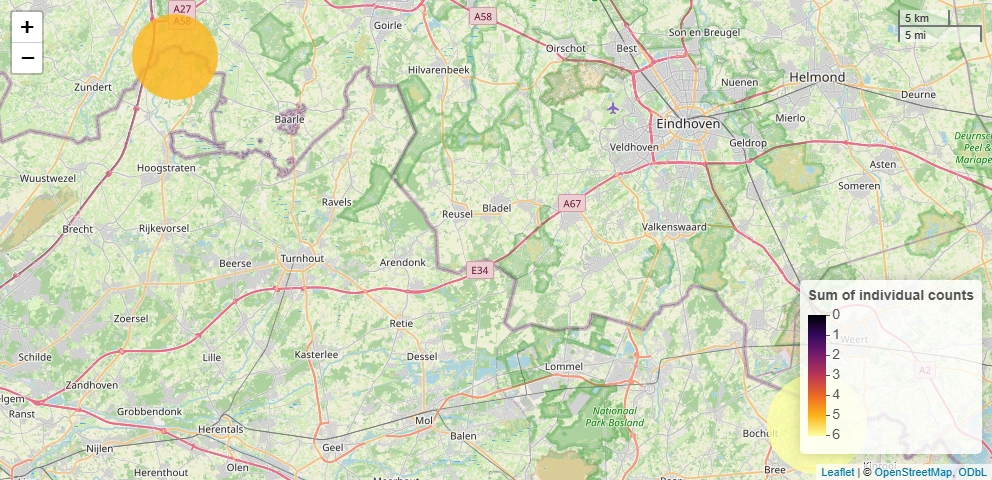

# camtraptor

camtraptor is an R package to explore and visualize Camera Trap Data
Packages ([Camtrap DP](https://camtrap-dp.tdwg.org/)). It offers a
step-by-step workflow to read Camtrap DP files, filter data of interest,
summarize information (e.g. number of observed species) and visualize
this per deployment on an interactive map. You can also use it to
transform data for analysis in
[camtrapR](https://cran.r-project.org/package=camtrapR).

camtraptor 1.0 updates the internal data model to Camtrap DP 1.0 and
drops support for Camtrap DP 0.1.6. This breaking change is accompanied
by a number of other major changes. See the
[changelog](https://inbo.github.io/camtraptor/news/index.html#camtraptor-100)
for details.

## Get started

To get started, see:

- [Vignettes](https://inbo.github.io/camtraptor/articles/): tutorials
  showcasing functionality.
- [Function
  reference](https://inbo.github.io/camtraptor/reference/index.html):
  overview of all functions.

## Installation

You can install the development version of camtraptor from
[GitHub](https://github.com/) with:

``` r

# install.packages("pak")
pak::pak("inbo/camtraptor")
```

## Example

Get an overview of the species detected in an example Camera Trap Data
Package dataset:

``` r

library(camtraptor)
#> 
#> Attaching package: 'camtraptor'
#> The following object is masked from 'package:base':
#> 
#>     contributors
x <- example_dataset()
taxa(x)
#> # A tibble: 10 × 5
#>    scientificName     taxonID  taxonRank vernacularNames.eng vernacularNames.nld
#>    <chr>              <chr>    <chr>     <chr>               <chr>              
#>  1 Anas platyrhynchos https:/… species   mallard             wilde eend         
#>  2 Anas strepera      https:/… species   gadwall             krakeend           
#>  3 Ardea              https:/… genus     great herons        reigers            
#>  4 Ardea cinerea      https:/… species   grey heron          blauwe reiger      
#>  5 Aves               https:/… class     bird sp.            vogel              
#>  6 Homo sapiens       https:/… species   human               mens               
#>  7 Martes foina       https:/… species   beech marten        steenmarter        
#>  8 Mustela putorius   https:/… species   European polecat    bunzing            
#>  9 Rattus norvegicus  https:/… species   brown rat           bruine rat         
#> 10 Vulpes vulpes      https:/… species   red fox             vos
```

Filter the observations in the dataset on female mallards (Anas
platyrhynchos) and map the number of recorded individuals for each
deployment location:

``` r

x %>%
  filter_observations(
    scientificName == "Anas platyrhynchos",
    sex == "female"
  ) %>%
  summarize_observations() %>%
  map_summary(feature = "sum_count")
```



## Relation to other R packages

- [camtrapdp](https://cran.r-project.org/package=camtrapdp) is a core R
  package to read and manipulate Camtrap DPs. camtraptor depends on
  camtrapdp and re-exports a number of functions so that users don’t
  need to load both packages.
- [camtrapR](https://cran.r-project.org/package=camtrapR) is an analysis
  R package for camera trap data. camtraptor initially offered a number
  of functions to transform Camtrap DPs to outputs compatible with
  camtrapR. These have been superseded, because camtrapR now supports
  reading Camtrap DPs.
- [camtrapDensity](https://github.com/MarcusRowcliffe/camtrapDensity) is
  a development R package to run single species random encounter models
  to estimate animal density. camtraptor is a dependency.

## Meta

- We welcome
  [contributions](https://inbo.github.io/camtraptor/CONTRIBUTING.html)
  including bug reports.
- License: MIT
- Get citation information for camtraptor in R with
  `citation("camtraptor")`.
- Please note that this project is released with a [Contributor Code of
  Conduct](https://inbo.github.io/camtraptor/CODE_OF_CONDUCT.html). By
  participating in this project you agree to abide by its terms.
